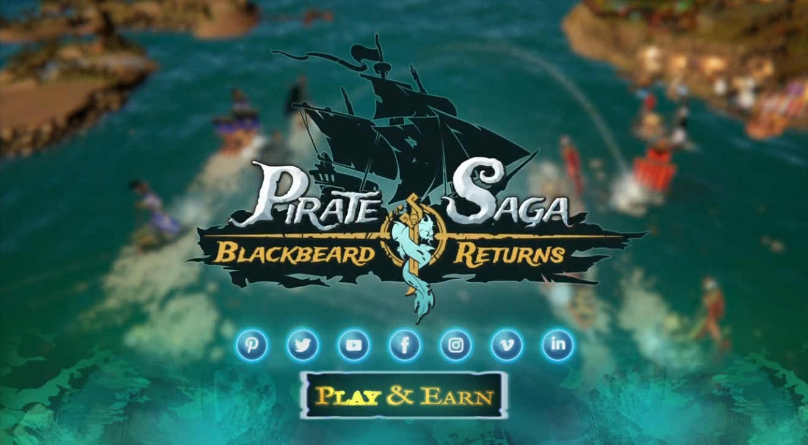

### Hi! I've always wanted to make video games, so I do

 * [LinkedIn](https://www.linkedin.com/in/micha%C5%82-wi%C4%99cek-8286b1206/)
 
___
**My interests:**
🕹 `GameDev`
🛠 `Software architecture`
🗃 `Backend`
🤖 `AI`
⛰ `Procedural generation`

___
**🔥 Favorite technologies:**
`C#` `UnityEngine`

**🛠 I use also:**
`C++`
`C`,
`Bash`,
`LaTeX`
  
___
| **Title**               | Description                                     | Project type           |
| :----------------------:        | :---------------------------------------------------: | :----------------: |
| [Pirate Saga] `2022`            |  MMORPG in pirate world. Play to earn.  | Commercial [Pixel Storm] |
| [World Generator] `2021`        |  Pseudoinfinite, procedural 3D world generator. | Personal|
| [Cyber Fusion] `2021`           | Android and iOS, idle tower defense game. | Commercial [Pixel Storm] |

[Pixel Storm]: https://pixelstorm.pl/
[Cyber Fusion]: https://play.google.com/store/apps/details?id=com.PixelStorm.CyberPolice2&hl=pl&gl=US
[World Generator]: https://github.com/wiecek1873/WorldGenerator
[Pirate Saga]: https://www.youtube.com/watch?v=K12RCeAFSE4&ab_channel=bkazmierczakful

[MegaPixel Studio]: https://megapixel-studio.com/
