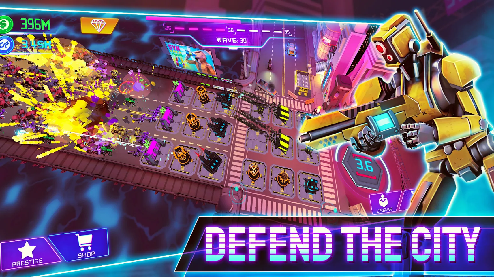

### Hi!
I’m an Control Engineering & Robotics engineer in the course of doing master degree of Computer Science.
I used to gain experience as game developer in [Pixel Storm Game Studio](https://pixelstorm.pl/).

 • [LinkedIn](https://www.linkedin.com/in/micha%C5%82-wi%C4%99cek-8286b1206/)

___
**My interests:**
🕹 `GameDev`
🛠 `Software architecture`
🗃 `Backend`
🤖 `AI`
⛰ `Procedural generation`

___
**🔥 Favorite technologies:**
`C#` `UnityEngine`

**🛠 I use also:**
`C++`
`C`,
`Bash`,
`LaTeX`
  
___
| **Main projects** | Description                                     | Project type           |
| :---------------- | :--------------------------------------------------- | :---------------- |
| [Cyber Fusion]    | Android and iOS, idle tower defense game. | Commercial |
| [World Generator] | Personal, pseudoinfinite, procedural 3D world generator. | `Unity3D`      |
|                   |    | |

[Cyber Fusion]: https://play.google.com/store/apps/details?id=com.PixelStorm.CyberPolice2&hl=pl&gl=US
[World Generator]: https://github.com/wiecek1873/WorldGenerator
